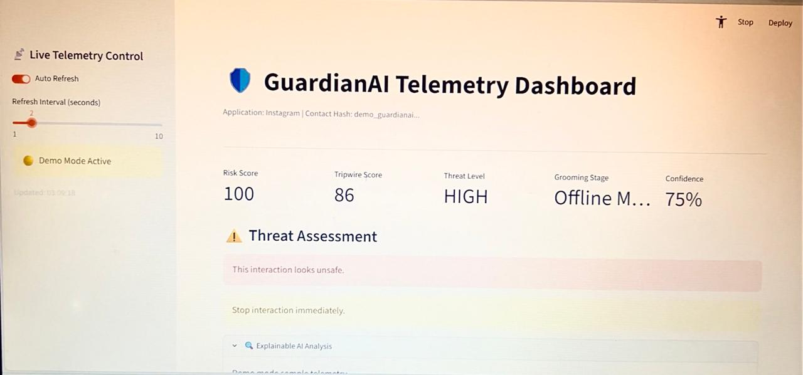
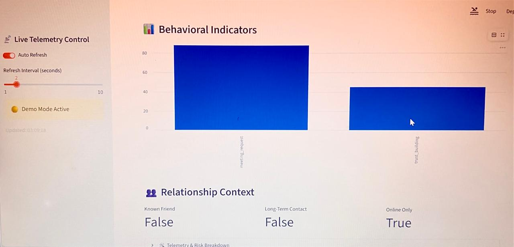

# 🛡️ Guardian AI  
### AI-Powered Grooming Detection System for Online Safety


---

# 📖 Overview

Guardian AI is an AI-powered safety system designed to detect potential **online grooming behaviours** before they escalate into exploitation.

The system combines **Natural Language Processing (NLP), behavioural analysis, and privacy-first AI architecture** to identify manipulation patterns and provide early risk assessment.

Unlike traditional moderation systems that depend only on keyword detection, Guardian AI analyses **conversation context, intent, and behavioural patterns** to identify possible grooming attempts.

The system detects patterns such as:

- 💬 Trust building
- 🔐 Secrecy requests
- ❤️ Emotional manipulation
- 📷 Image requests
- 📝 Personal information requests
- 📍 Physical meetup attempts

---

# 🎯 Problem Statement

Online grooming is a gradual manipulation process where attackers build emotional connections with victims before exploitation.

Traditional detection methods face challenges such as:

- Lack of contextual understanding
- Dependence on fixed keywords
- High false-positive rates
- Privacy concerns with cloud-based message analysis
- Difficulty identifying early-stage grooming behaviour

Guardian AI aims to provide an intelligent early-warning system while maintaining user privacy.

---

# 💡 Solution

Guardian AI uses a hybrid AI approach consisting of:

## 🧠 Local Tripwire AI

A lightweight local analysis layer that detects suspicious behavioural signals before sending information externally.

It performs:

- NLP-based classification
- Rule-based pattern detection
- Risk scoring

---

## 🤖 Sentinel AI Backend

A backend intelligence layer that performs deeper behavioural analysis and maintains risk history.

It provides:

- Advanced conversation analysis
- Risk evaluation
- Behavioural summaries
- Threat classification

---

## 🔒 Privacy-First Design

Guardian AI follows a privacy-preserving architecture by:

- Minimizing raw message transmission
- Processing sensitive information locally whenever possible
- Using hashed identifiers
- Sending only required analysis information

---

# 🏗️ System Architecture

```
                 User Conversation
                        |
                        ↓
          Android Accessibility Service
                        |
                        ↓
              Local Tripwire AI
        (NLP + Rules + Risk Calculation)
                        |
                        ↓
              Risk Assessment JSON
                        |
                        ↓
              Sentinel AI Backend
                 (FastAPI Server)
                        |
                        ↓
              Behaviour Analysis
                        |
                        ↓
             Streamlit Dashboard
```

---

# ⚙️ System Components

| Component | Technology | Purpose |
|-----------|------------|---------|
| Android Client | Kotlin | Secure conversation extraction |
| Local Tripwire AI | Python + Transformers | Early risk detection |
| NLP Engine | HuggingFace Transformers | Behaviour classification |
| Backend API | FastAPI | Analysis and history management |
| Dashboard | Streamlit | Risk visualization |

---

# 🧠 AI & NLP Pipeline

Guardian AI combines Transformer-based NLP with behavioural intelligence.

---

## 1. Zero-Shot NLP Classification

The system uses a Transformer-based zero-shot classification model to analyse conversation behaviour.

Detected categories include:

- Normal conversation
- Trust building
- Secrecy request
- Emotional manipulation
- Image request
- Meetup request
- Personal information request
- Sexual request
- Age discrepancy

The model identifies behavioural patterns without requiring a large manually labelled dataset.

---

## 2. Behavioural Risk Scoring

The final risk score combines multiple signals:

```
Final Risk Score =
ML Classification Score
+
Rule-Based Behaviour Score
+
Conversation Context Analysis
```

The system evaluates:

- Excessive trust building
- Isolation attempts
- Requests for private information
- Image requests
- Attempts to move conversations offline

---

## 3. Noise Detection

To reduce false positives, Guardian AI applies noise filtering techniques:

- Character entropy analysis
- Text uniqueness analysis
- Vowel distribution checks
- Gibberish detection

---

# 🚨 Risk Classification

| Risk Level | Description |
|------------|-------------|
| 🟢 LOW RISK | Normal conversation behaviour |
| 🟡 SUSPICIOUS | Potential manipulation patterns detected |
| 🔴 HIGH RISK | Strong grooming indicators detected |

---

# 📊 Dashboard

Guardian AI provides a Streamlit dashboard for visualizing AI-generated risk assessments.

The dashboard displays:

- Risk Score
- Tripwire Score
- Threat Level
- Grooming Stage
- Confidence Score
- Behavioural Indicators
- Relationship Context
- Risk Analysis History

---

## Dashboard Overview



---

## Behavioural Analysis

The behavioural analysis module highlights detected manipulation patterns and provides additional context about the conversation.



---

# 🛠️ Tech Stack

## Programming Languages

- Python
- Kotlin

## Artificial Intelligence

- HuggingFace Transformers
- Zero-Shot Classification
- Natural Language Processing
- Behavioural Risk Analysis

## Backend

- FastAPI
- REST APIs
- JSON Communication

## Frontend

- Streamlit Dashboard
- Android Application

## Development Tools

- Git
- GitHub
- Uvicorn

---

# 📂 Project Structure

```
Guardian-AI/

│
├── android-client/
│   └── Android Accessibility Service
│
├── local-ai/
│   ├── conversation_analyzer.py
│   ├── risk_engine.py
│   └── adapter.py
│
├── backend-api/
│   ├── FastAPI Server
│   ├── API Routes
│   └── Database Layer
│
├── dashboard/
│   └── Streamlit Dashboard
│
├── images/
│   ├── dashboard_overview.png
│   └── behavioural_analysis.png
│
├── requirements.txt
└── README.md
```

---

# 🚀 Installation & Usage

## Clone Repository

```bash
git clone https://github.com/Minnushar/guardian-ai.git
```

```bash
cd guardian-ai
```

---

## Install Dependencies

```bash
pip install -r requirements.txt
```

---

## Start Backend Server

```bash
uvicorn main:app --reload
```

---

## Run Dashboard

```bash
streamlit run dashboard.py
```

---

# 🎥 Demo

A demonstration video showcasing the Guardian AI dashboard workflow, risk assessment, and behavioural analysis.

(Add your demo video link here)

---

# 🔮 Future Enhancements

Future improvements include:

- Real-time Android integration
- Multilingual grooming detection
- Explainable AI risk reasoning
- Parent/guardian alert system
- Behaviour timeline analysis
- Privacy-preserving continuous learning

---

# 🌍 Impact

Guardian AI aims to create a proactive digital safety layer that identifies harmful online interactions at an early stage.

By combining **AI-based behavioural understanding** with a **privacy-first architecture**, Guardian AI moves beyond traditional moderation systems toward intelligent online protection.

---

# 👥 Team Guardian AI

Built as part of an AI and cybersecurity innovation initiative focused on creating safer online environments through responsible artificial intelligence.

---

⭐ If you find this project interesting, consider starring the repository!